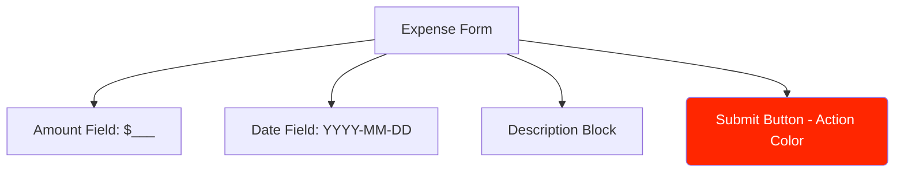

# UC-01: Submit Expense
**Actor:** Employee
**Trigger:** Employee needs reimbursement for business expense.
**Precondition:** Employee is logged in.
**Postcondition:** Expense report is saved in "Pending" status.

## Main Success Scenario
1. Employee navigates to "Submit Expense" page.
2. System displays expense form.
3. Employee enters Amount, Date, and Description.
4. Employee clicks "Submit".
5. System validates input and persists to database.
6. System displays success message and redirects to Dashboard.

## UI Mockup

