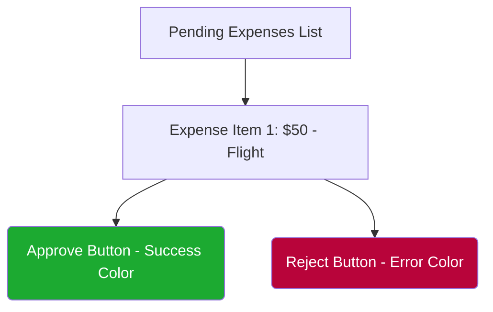

# UC-02: Review Expense
**Actor:** Manager
**Trigger:** Manager logs in to review pending expenses.
**Precondition:** Manager is logged in and there are pending expenses.
**Postcondition:** Expense is marked as "Approved" or "Rejected".

## Main Success Scenario
1. Manager views Manager Dashboard.
2. System lists all "Pending" expenses.
3. Manager clicks "Approve" or "Reject" on an item.
4. System updates database status.
5. System removes item from pending list.

## UI Mockup

