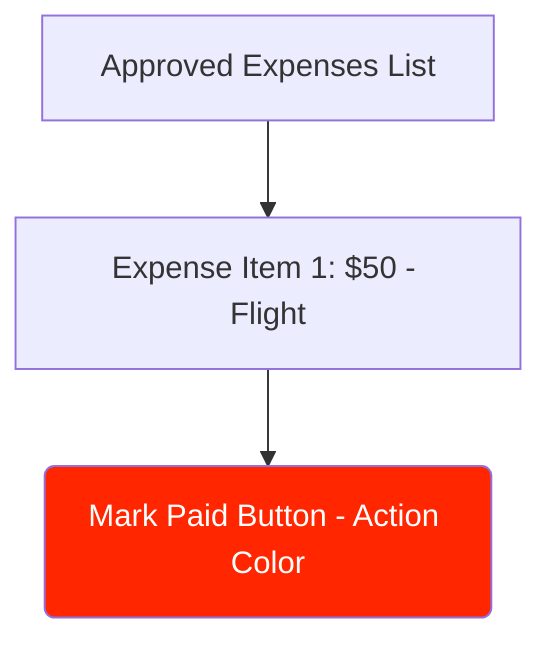

# UC-03: Process Payout
**Actor:** Finance Admin
**Trigger:** Finance admin processes payouts for approved expenses.
**Precondition:** Finance Admin is logged in, there are approved expenses.
**Postcondition:** Expense marked as "Paid".

## Main Success Scenario
1. Admin views Finance Dashboard.
2. System lists all "Approved" expenses.
3. Admin clicks "Mark Paid" on an item.
4. System updates database status.
5. System removes item from pending payout list.

## UI Mockup

