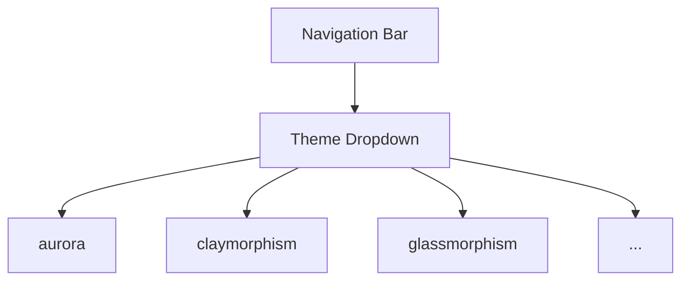

# UC-04: Change UI Theme
**Actor:** All Users
**Trigger:** User wants to change the application appearance.
**Precondition:** User is viewing any page.
**Postcondition:** Application theme is updated and persisted.

## Main Success Scenario
1. User clicks the "Theme" dropdown in the navigation bar.
2. System displays 10 theme options.
3. User selects a skin (e.g., "aurora").
4. System dynamically changes the CSS variables mapping to Tailwind classes.
5. System persists the preference (via localStorage or cookies).

## UI Mockup

